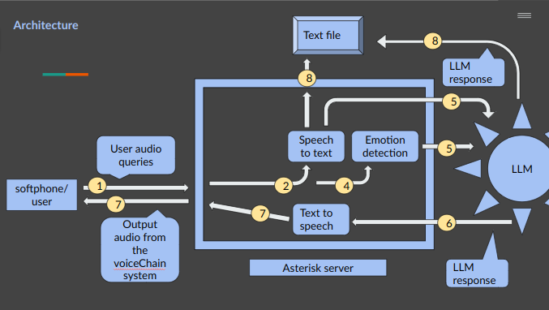

# VoiceChain: Secure Automated IVR with LLM Integration and Blockchain-based Call Record Storage

## Project Overview
VoiceChain is a secure and automated IVR system that integrates with Large Language Models (LLMs). The project enables audio call handling through Asterisk, processes audio data using speech-to-text and text-to-speech conversion, and stores call records as text file.

---
## Architecture 



---

## Features
- **Automated IVR System**: Handles incoming calls and provides automated responses.
- **LLM Integration**: Queries an LLM for intelligent responses based on PDF content.
- **Audio Processing**: Converts audio to text and generates voice responses.
---

## System Requirements
- **Operating System**: Ubuntu 20.04 or later
- **Dependencies**: Python 3.8+

---

## Installation Guide


### 2. Install FFmpeg
```bash
sudo apt update
sudo apt install ffmpeg
```

### 3. Install Python Libraries


#### Required Python Libraries:
- **Speech Recognition**:
  ```bash
  pip install SpeechRecognition
  ```
- **tensorflow**:
  ```bash
  pip install tensorflow==2.9
  ```
- **Text-to-Speech (gTTS)**:
  ```bash
  pip install gTTS
  ```
- **LLM Integration (HuggingFace Transformers)**:
  ```bash
  pip install transformers
  ```
- **Audio Processing (pydub)**:
  ```bash
  pip install pydub
  ```

- **Other Dependencies**:
  ```bash
  pip install requests numpy
  ```

---


# Installation Guide for Ollama and Llama 3

## Prerequisites
Make sure your system meets the following requirements:
- **Operating System:** Ubuntu 20.04 or later / macOS 12 or later / Windows (WSL2 recommended)
- **Python Version:** 3.8 or later
- **CUDA Support (Optional):** For GPU acceleration
- **Docker (Optional):** If using Docker containers

---

## 1. Install Ollama

### Linux (Ubuntu/Debian)
```bash
# Update and install required dependencies
sudo apt update && sudo apt install curl git

# Download and install Ollama
curl -fsSL https://ollama.ai/install.sh | sh
```

### macOS
```bash
brew install ollama
```

### Windows (WSL2)
1. Enable WSL2 and install Ubuntu from the Microsoft Store.
2. Follow the Linux (Ubuntu/Debian) steps inside WSL2.

### Verify Installation
```bash
ollama --version
```

---

## 2. Install Llama 3 Model

### Download the Llama 3 Model
```bash
ollama pull llama3
```

### Run Llama 3 Model
```bash
ollama run llama3
```

### Test the Model
```bash
echo "What is the capital of France?" | ollama run llama3
```

---

## 3. Optional GPU Support
Ensure CUDA is installed if you want GPU acceleration.

```bash
nvidia-smi  # Verify CUDA availability
```
Then enable GPU support while running:
```bash
OLLAMA_USE_CUDA=1 ollama run llama3
```

---

## 4. Updating Ollama
```bash
sudo ollama update
```

---

## 5. Troubleshooting
1. **Permission Denied Error:**
   - Ensure you have execute permissions:
     ```bash
     chmod +x /usr/local/bin/ollama
     ```
2. **Model Not Found Error:**
   - Ensure the model is pulled properly:
     ```bash
     ollama list
     ```
3. **GPU Issues:**
   - Update NVIDIA drivers and CUDA Toolkit.

---

## 6. Uninstall Ollama
```bash
sudo rm -rf /usr/local/bin/ollama
```

---

## Notes
- Visit the [Ollama Documentation](https://ollama.ai/docs) for more details.
- For troubleshooting or support, refer to the GitHub issues page of Ollama.


### softphone setup

setup the softphone using this video
[video](https://www.youtube.com/watch?v=rtHFdhCm434&t=591s)

# caution "" based on the current postion of the project, the softphone and the server have to be in the same network(same wifi), as asterisk is mainly for private network.   


## Future Enhancements
- Multi-language support for IVR.
- Enhanced speaker verification, using neural networks.
- Expanded blockchain capabilities for audit trails.

---

## Contributors
- **Sushovan Pan**

---

## License
This project is licensed under the MIT License.


